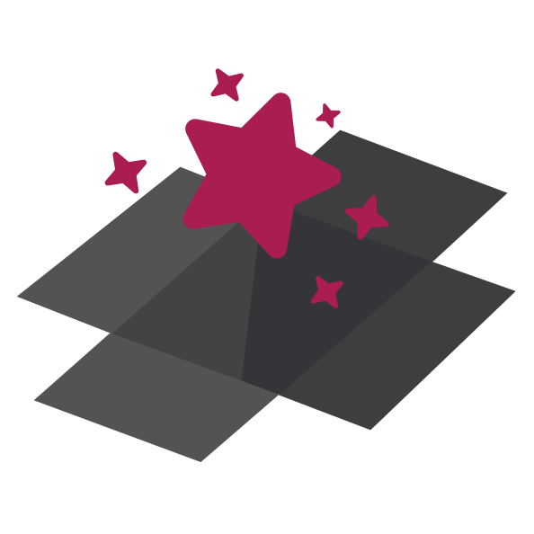
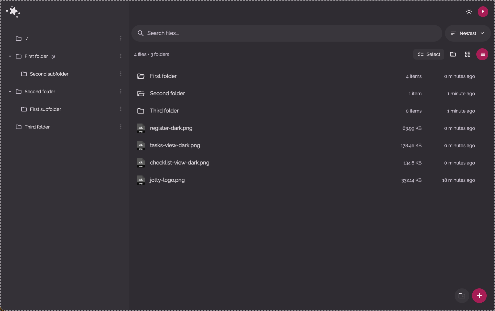
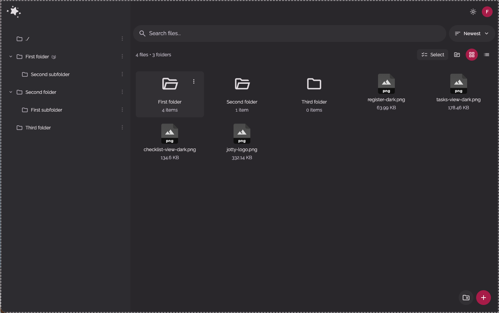

<p align="center">
  
  <br />
  <h1 align="center">Scatola Magica</h1><br/>
</p>

A simple, self-hosted file storage and management app.

Tired of bloated, EXPENSIVE cloud storage solutions? [Scatola Magica](https://scatola-magica.example.com) is a lightweight alternative for managing your personal files and folders. It's built with Next.js 14, is easy to deploy, and keeps all your data on your own server.

---

<p align="center">
  <a href="http://discord.gg/invite/mMuk2WzVZu">
    
  </a>
  <br />
  <i>Join the discord server for more info!</i>
  <br />
</p>

---

<br />

<div align="center">
  <p align="center">
    <em>Clean, intuitive interface for managing your files and folders.</em>
  </p>
  
  <p align="center">
    <em>Both list and grid view available.</em>
  </p>
  
</div>

## Quick nav

- [How to contribute](#contribute)
- [Features](#features)
- [Tech Stack](#tech-stack)
- [Getting Started](#getting-started)
  - [Docker Compose (Recommended)](#docker-compose-recommended)
  - [Initial Setup](#initial-setup)
  - [Local Development (Without Docker)](#local-development-without-docker)
- [Data Storage](#data-storage)
- [Versioning Scheme](#versioning)
- [Updating](#updating)
  - [Docker Compose](#docker-compose-1)
  - [Manual](#manual)
- [API](#api)
- [Shortcuts](#shortcuts)
- [Single Sign-On (SSO) with OIDC](#single-sign-on-sso-with-oidc)
- [Custom Themes and Emojis](#custom-themes-and-emojis)

<p align="center">
  <br />
  <a href="https://www.buymeacoffee.com/fccview">
    
  </a>
</p>

<a id="contribute"></a>

## How to contribute

Hi, it's amazing having a community willing to push new feature to the app, and I am VERY open to contributors pushing their idea, it's what makes open source amazing.

That said for the sake of sanity let's all follow the same structure:

- When creating a new branch, do off from the `develop` branch, this will always be ahead of `main` and it's what gets released
- When creating a pull request, direct it back into `develop`, I' ll then review it and merge it. Your code will end up in the next release that way and we all avoid conflicts!
- Please bear with on reviews, it may take a bit of time for me to go through it all on top of life/work/hobbies :)

<a id="features"></a>

## Features

- **File Management:** Browse, upload, download, and organize your files in a hierarchical folder structure.
- **Search & Sort:** Powerful search functionality and multiple sorting options for finding files quickly.
- **Chunk uploader** Uses chunk technology to upload files in small chunks in parallel. On a local network the upload will be as fast as your internet speed/hard drive rw speed allows.
- **Drop/paste to upload** This is truly a magic box (scatola magica), drag a file anywhere in any screen (yes, the settings too) and it'll upload it on the dedicated upload folder. You can even copy a file and ctrl+v into the app, I promise it will work!
- **Upload folders** You can literally drag a folder on the screen and it'll magically upload it in the right place, with all subfolders/files within it.
- **Responsive Design:** Works seamlessly on desktop, tablet, and mobile devices.
- **File-Based:** No database needed! Everything is stored in simple files and folders in a single data directory.

<a id="tech-stack"></a>

## Tech Stack

- **Framework:** Next.js 14
- **Language:** TypeScript
- **Styling:** Tailwind CSS

<a id="getting-started"></a>

## Getting Started

The recommended way to run `Scatola Magica` is with Docker.

<a id="docker-compose-recommended"></a>

### Docker Compose (Recommended)

1.  Create a `docker-compose.yml` file:

    **📖 For advanced settings and more information about how the docker compose file works and what these variables do, please read [howto/DOCKER.md](howto/DOCKER.md)**

    ```yaml
    services:
      scatola-magica:
        image: ghcr.io/fccview/scatola-magica:latest
        container_name: scatola-magica
        user: "1000:1000"
        ports:
          - "1133:3000"
        volumes:
          - ./uploads:/app/data/uploads:rw
          - ./config:/app/data/config:rw
          - ./cache:/app/.next/cache:rw
        restart: unless-stopped
        environment:
          - NODE_ENV=production
    ```

2.  Create the directories and set permissions:

    ```bash
    mkdir -p uploads/temp cache
    sudo chown -R 1000:1000 uploads/
    sudo chown -R 1000:1000 config/
    sudo chown -R 1000:1000 cache/
    ```

    **Note:** The cache directory is optional. If you don't want cache persistence, you can comment out the cache volume line in your `docker-compose.yml`.

3.  Start the container:

    ```bash
    docker compose up -d
    ```

The application will be available at `http://localhost:1133`.

<a id="initial-setup"></a>

### Initial Setup

On your first visit, you'll be redirected to `/auth/setup` to create your admin account if SSO is disabled, otherwise you'll be prompted to sign in via your choosen SSO provider.

Once that's done, you're ready to go! First user will be admin by default.

<a id="local-development-without-docker"></a>

### Local Development (Without Docker)

If you want to run the app locally for development:

1.  **Clone & Install:**

    ```bash
    git clone <repository-url>
    cd scatola-magica
    yarn install
    ```

2.  **Run Dev Server:**

    ```bash
    yarn dev
    ```

    The app will be running at `http://localhost:3000`.

<a id="data-storage"></a>

## Data Storage

`Scatola Magica` uses a simple file-based storage system with the following directory structure:

- `uploads/`: Stores all uploaded files and folders.
- `uploads/temp/`: Temporary files chunks during upload processing.
- `config/users.json`: User accounts.
- `config/sessions.json`: User session data.
- `config/preferences.json`: App preferences and settings.
- `config/avatars/`: User profile pictures.

**Make sure you back up both the `uploads` and `config` directories!**

<a id="versioning"></a>

## Versioning Scheme

This project uses a `[STABLE].[FEATURE].[FIX]` versioning scheme, not strict [SemVer](https://semver.org/). As a product (not a package), this format makes more sense for my specific release cycle.

My format is `1.10.1`, which breaks down as:

- **`1.x.x` (Stable):** The `1` represents the current stable generation. I will only change this (e.g., to `2.0.0`) for a complete rewrite or a fundamental shift in the product or seriously breaking changes.

- **`x.10.x` (Feature):** This is the main release number. I increment this for new features, code refactors, or significant changes (e.g., `1.9.0` -> `1.10.0`). This is the equivalent of a SemVer `MINOR` bump.

- **`x.x.1` (Fix):** This is incremented _only_ for hotfixes, bug-fix-only and very minor feature releases (e.g., `1.10.0` -> `1.10.1`). This is the equivalent of a SemVer `PATCH` bump.

### A Note on "Breaking" Changes

A **Feature** release (like `1.10.0`) may include major backend or data structure changes. When this happens, **I will always provide an automatic migration script** that runs on first launch to update your data seamlessly.

Because the migration is automatic, I do not consider this a "breaking" change that requires a `2.0.0` version.

I will always detail these migrations in the release notes. I _highly recommend_ you **back up your data** before any feature update, just in case.

<a id="updating"></a>

## Updating

<a id="docker-compose-1"></a>

### Docker Compose

Pull the latest image and restart your container.

```bash
docker compose pull
docker compose up -d
```

<a id="manual"></a>

### Manual

If you're running from source, pull the latest changes and rebuild.

```bash
git pull
yarn install
yarn build
yarn start
```

<a id="api"></a>

## API

`Scatola Magica` includes a REST API for programmatic access to your files and folders. This is perfect for:

- **Automation:** Upload files from external systems
- **Integrations:** Connect with other tools and services
- **Scripts:** Automate file operations
- **Backups:** Programmatic access to your files

📖 **For the complete API documentation, see [howto/API.md](howto/API.md)**

<a id="shortcuts"></a>

## SHORTCUTS

`Scatola Magica` supports a wide range of keyboard shortcuts to help you navigate and manage files more efficiently without leaving the keyboard.

📖 **For the complete SHORTCUTS documentation, see [howto/SHORTCUTS.md](howto/SHORTCUTS.md)**

<a id="single-sign-on-sso-with-oidc"></a>

## Single Sign-On (SSO) with OIDC

`Scatola Magica` supports any OIDC provider (Authentik, Auth0, Keycloak, Okta, Google, EntraID, etc.)

📖 **For the complete SSO documentation, see [howto/SSO.md](howto/SSO.md)**

<a id="custom-themes-and-emojis"></a>

## Custom Manifest

You can completely customize your PWA by creating an override manifest file. This allows you to change the app name, description, icons, colors, and more. Custom themes and emojis can be managed through the admin UI.

📖 **For the complete customisation documentation, see [howto/CUSTOMISATIONS.md](howto/CUSTOMISATIONS.md)**

📖 **For better understanding on how the PWA works see [howto/PWA.md](howto/PWA.md)**

## License

This project is licensed under [MIT License](LICENSE).

## Support

For issues and questions, please open an issue on the GitHub repository.

## Star History

[](https://www.star-history.com/#fccview/scatola-magica&type=date&legend=top-left)
