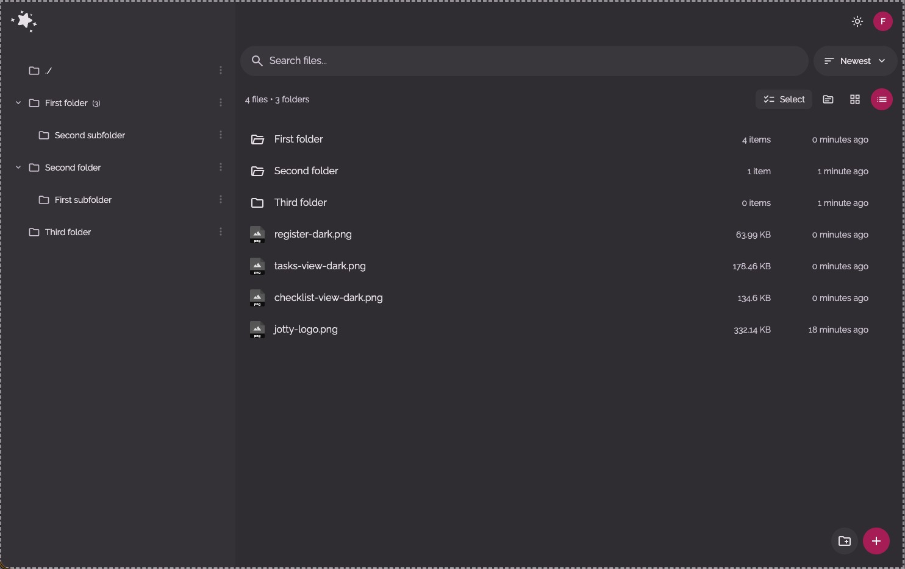
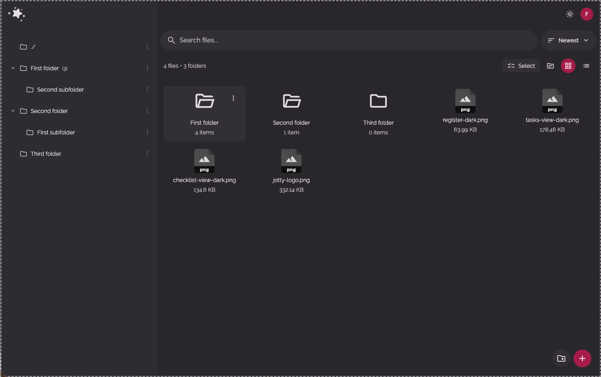

<p align="center">
  
  <br />
  <h1 align="center">Scatola Magica</h1><br/>
</p>

A simple, self-hosted file storage/transfer app.

[Scatola Magica](https://www.youtube.com/watch?v=pvn0KHxzesE) is a privacy first, lightweight alternative to overcomplicated, bloated file storage solutions, to transfer, manage, encrypt/decrypt your personal files and folders. It's built with Next.js 16, is easy to deploy, and keeps all your data on your own server.

It features optional PGP encryption for stored items and optional AES-256-GCM encryption for file transfer. Read more about how encryption works in the [howto/ENCRYPTION.md](howto/ENCRYPTION.md) guide.

Watch a quick demo of some of the app functionality [here](https://www.youtube.com/watch?v=pvn0KHxzesE) (enable subtitles!!)

Please check the [howto](howto/) guides before raising issues, your questions may already have been answered.

---

<p align="center">
  <a href="http://discord.gg/invite/mMuk2WzVZu">
    
  </a>
  <br />
  <i>Join the discord server for more info!</i>
  <br />
</p>

---

<br />

<div align="center">
  <p align="center">
    <em>Clean, intuitive interface for managing your files and folders.</em>
  </p>
  
  <p align="center">
    <em>Both list and grid view available.</em>
  </p>
  
</div>

## Run

By default the app will run on port `1133` with user `1000:1000`, please check [howto/ENV.md](howto/ENV.md) for a comprehensive list of env variables and [howto/DOCKER.md](howto/DOCKER.md) for what every compose setting does.

```bash
mkdir -p uploads/temp config cache
sudo chown -R 1000:1000 uploads config cache
```

The `cache` directory is optional. If you don't want cache persistence, drop the cache volume line from your compose file.

<details>
<summary>Docker Compose</summary>

Ready-to-use compose files live in [`docker-compose-examples/`](docker-compose-examples/). Pick one and save it as `docker-compose.yml` next to the folders you just created:

| File | What it runs | When to use |
| :--- | :----------- | :---------- |
| [`simple.yml`](docker-compose-examples/simple.yml) | Scatola Magica | One container for personal use. The cache lives in memory. |
| [`valkey.yml`](docker-compose-examples/valkey.yml) | Scatola Magica + Valkey | Several replicas, a big library, or a cache that should survive restarts. |

```bash
docker compose up -d
```

</details>

<details>
<summary>Inline docker</summary>

```bash
docker run -d --name scatola-magica --user 1000:1000 -p 1133:3000 -v ./uploads:/app/data/uploads -v ./config:/app/data/config -v ./cache:/app/.next/cache -e NODE_ENV=production --restart unless-stopped ghcr.io/fccview/scatola-magica:latest
```

</details>

<details>
<summary>Run natively</summary>

You'll need a `.env` file for your env variables, [Node.js](https://nodejs.org) 22.15 or later and [yarn](https://yarnpkg.com).

```bash
git clone https://github.com/fccview/scatola-magica.git
cd scatola-magica
yarn install
yarn build
yarn start
```

For local development run `yarn dev` instead of the last two commands, the app will be running at `http://localhost:3000`.

</details>

On your first visit, you'll be redirected to `/auth/setup` to create your admin account if SSO is disabled, otherwise you'll be prompted to sign in via your choosen SSO provider. First user will be admin by default.

<p align="center">
  <br />
  <a href="https://www.buymeacoffee.com/fccview">
    
  </a>
</p>

## Features

- **File Management:** Browse, upload, download, and organize your files in a hierarchical folder structure.
- **Search & Sort:** Powerful search functionality and multiple sorting options for finding files quickly.
- **Chunk uploader** Uses chunk technology to upload files in small chunks in parallel. On a local network the upload will be as fast as your internet speed/hard drive rw speed allows.
- **Drop/paste to upload** This is truly a magic box (scatola magica), drag a file anywhere in any screen (yes, the settings too) and it'll upload it on the dedicated upload folder. You can even copy a file and ctrl+v into the app, I promise it will work!
- **Pasting text** creates a new `.txt` file automatically
- **Upload folders** You can literally drag a folder on the screen and it'll magically upload it in the right place, with all subfolders/files within it.
- **Responsive Design:** Works seamlessly on desktop, tablet, and mobile devices.
- **File-Based:** No database needed! Everything is stored in simple files and folders in a single data directory.

## Data storage

`Scatola Magica` uses a simple file-based storage system with the following directory structure:

- `uploads/`: Stores all uploaded files and folders.
- `uploads/temp/`: Temporary files chunks during upload processing.
- `config/users.json`: User accounts.
- `config/sessions.json`: User session data.
- `config/preferences.json`: App preferences and settings.
- `config/avatars/`: User profile pictures.

**Make sure you back up both the `uploads` and `config` directories!**

## Updating

<details>
<summary>Docker Compose</summary>

Pull the latest image and restart your container.

```bash
docker compose pull
docker compose up -d
```

</details>

<details>
<summary>Run natively</summary>

Pull the latest changes and rebuild.

```bash
git pull
yarn install
yarn build
yarn start
```

</details>

<details>
<summary>Versioning scheme</summary>

This project uses a `[STABLE].[FEATURE].[FIX]` versioning scheme, not strict [SemVer](https://semver.org/). As a product (not a package), this format makes more sense for my specific release cycle.

My format is `1.10.1`, which breaks down as:

- **`1.x.x` (Stable):** The `1` represents the current stable generation. I will only change this (e.g., to `2.0.0`) for a complete rewrite or a fundamental shift in the product or seriously breaking changes.

- **`x.10.x` (Feature):** This is the main release number. I increment this for new features, code refactors, or significant changes (e.g., `1.9.0` -> `1.10.0`). This is the equivalent of a SemVer `MINOR` bump.

- **`x.x.1` (Fix):** This is incremented _only_ for hotfixes, bug-fix-only and very minor feature releases (e.g., `1.10.0` -> `1.10.1`). This is the equivalent of a SemVer `PATCH` bump.

#### A note on "breaking" changes

A **Feature** release (like `1.10.0`) may include major backend or data structure changes. When this happens, **I will always provide an automatic migration script** that runs on first launch to update your data seamlessly.

Because the migration is automatic, I do not consider this a "breaking" change that requires a `2.0.0` version.

I will always detail these migrations in the release notes. I _highly recommend_ you **back up your data** before any feature update, just in case.

</details>

## Documentation

Everything else lives in the [howto](howto/) folder:

| Guide | What's in it |
| :---- | :----------- |
| [DOCKER.md](howto/DOCKER.md) | Compose settings, volumes and the optional Valkey sidecar |
| [ENV.md](howto/ENV.md) | Every environment variable |
| [ENCRYPTION.md](howto/ENCRYPTION.md) | PGP storage encryption and AES-256-GCM transfer encryption |
| [SSO.md](howto/SSO.md) | Single sign-on with any OIDC provider (Authentik, Auth0, Keycloak, Okta, Google, EntraID, etc.) |
| [SHORTCUTS.md](howto/SHORTCUTS.md) | Keyboard shortcuts |
| [TORRENTS.md](howto/TORRENTS.md) | Downloading, creating and seeding torrents |
| [FILE-EXTENSIONS.md](howto/FILE-EXTENSIONS.md) | File types the viewer and editor understand |

## License

This project is licensed under [GNU LESSER GENERAL PUBLIC LICENSE](LICENSE).
I debated going for MIT, but I really want to protect this project and keep it open source.
This means private corporations can use it, but they MUST keep their improvements open source as well.

All image contents within this project are protected by Copyright and owned by The Pokémon Company.
All animations for the Pokémon images have been created by the [vscode-pokemon](https://github.com/jakobhoeg/vscode-pokemon) dev.

## Support

For issues and questions, please open an issue on the GitHub repository.

## Star History

[](https://www.star-history.com/#fccview/scatola-magica&type=date&legend=top-left)
